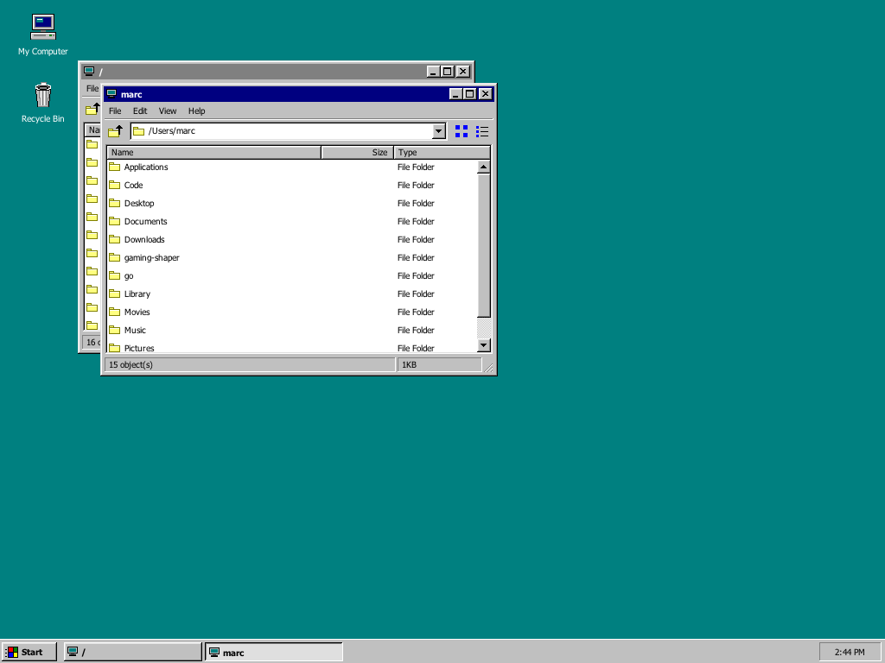

# BevelDesk

[](https://github.com/marchildmann/BevelDesk/actions/workflows/build.yml)
[](https://github.com/marchildmann/BevelDesk/releases/latest)
[](LICENSE)

**A Windows 95–style desktop environment that actually works — built entirely
with Dear ImGui's DrawList API.**

Teal desktop, beveled chrome, a real file manager over your actual filesystem,
and an MS-DOS Prompt running a *live shell* (your zsh) through a pty — every
bevel, caption bar, scrollbar and icon drawn by hand, pixel by pixel. No stock
ImGui styling, no image assets, no web views.



## Features

- **Theme95 rendering layer** — the 1995 visual language reproduced from
  research: the 16-color system palette (`#C0C0C0` chrome, `#000080`
  captions, `#008080` desktop), the four 3D bevel conventions (raised,
  pressed, sunken field, window frame — each with its distinct edge-color
  order), 18px captions, 16×14 caption buttons, procedurally drawn icons.
- **Real window management** — drag, resize, minimize to taskbar,
  maximize/restore with saved geometry, double-click captions, and the full
  system menu on the caption icon (double-click it to close, like the
  original).
- **Explorer** — browse your real filesystem: Details view with sortable
  columns (folders first, KB sizes right-aligned), Large Icons view, Up
  button, address well, status bar, custom Win95 scrollbars with arrow
  buttons and dithered tracks. Open as many windows as you like.
- **MS-DOS Prompt** — a genuine interactive shell (`$SHELL`) on a POSIX pty
  in an authentic fixed 80×25 terminal: VT100/xterm-subset emulation,
  16-color SGR (with 256-color mapping), OSC window titles, scrollback,
  Ctrl+C that actually interrupts. The window closes when the shell exits —
  just like 1995, except this one runs zsh. *(macOS/Linux)*
- **Taskbar & Start menu** — live clock, per-window task buttons with
  pressed/active states, and a working Start menu: Programs (MS-DOS Prompt),
  Documents / Find (Explorer), Settings (Display Properties), Help (About),
  Run… (a real Run box — type a folder to open it, or a command to run in a
  DOS prompt), Shut Down… (the iconic dithered screen-fade dialog).
- **UI zoom** — **Ctrl/Cmd + mouse-wheel** (or `+` / `-` / `0` on a US
  keyboard) scales the whole desktop through 1×–3×, with fonts re-rasterized
  at each level so text stays crisp (no bitmap blur). Handy on 4K/5K displays.
- **Display Properties** (Start ▸ Settings) — recolor the desktop from the
  classic 16-color picker, with a live monitor preview, OK/Cancel semantics
  included.
- **Crisp on Retina** — native-resolution rendering with the UI font
  (Tahoma / Microsoft Sans Serif / DejaVu, probed from your system)
  rasterized at monitor density. Fixed 96-dpi metrics, like the original.

## Download

Prebuilt binaries for every release are on the
[Releases page](https://github.com/marchildmann/BevelDesk/releases/latest):

- **macOS** — universal (Apple silicon + Intel) `BevelDesk.app`. Unsigned:
  right-click ▸ Open on first launch, or
  `xattr -d com.apple.quarantine BevelDesk.app`.
- **Linux x86_64** — needs OpenGL and X11/Wayland runtime libraries.
- **Windows x86_64** — note: the MS-DOS Prompt is POSIX-only for now.

## Building

Requirements: CMake ≥ 3.16, a C++17 compiler, network on first configure
(dependencies fetched via FetchContent: GLFW 3.4, Dear ImGui 1.92.8, stb).

### macOS

```sh
cmake -S . -B build -DCMAKE_BUILD_TYPE=Release
cmake --build build -j
./build/beveldesk                  # or double-click "build/BevelDesk.app"
```

### Linux

```sh
sudo apt install build-essential cmake libgl1-mesa-dev xorg-dev
cmake -S . -B build -DCMAKE_BUILD_TYPE=Release
cmake --build build -j
./build/beveldesk
```

### Windows (Visual Studio 2019+)

```bat
cmake -S . -B build
cmake --build build --config Release
build\Release\beveldesk.exe
```

*(The MS-DOS Prompt is POSIX-only for now — a ConPTY port is a welcome PR.)*

## Running

| Command | Effect |
|---|---|
| `./build/beveldesk` | normal 1024×768 window (`--windowed WxH` picks another size) |
| `./build/beveldesk --fullscreen` | total immersion — no host chrome; exit via Start ▸ Shut Down… or Cmd/Ctrl+Q |
| `./build/beveldesk --borderless` | square-cornered undecorated window; drag it by the taskbar's empty area, Cmd+M minimizes |
| `./build/beveldesk --zoom 1.5` | start at a UI zoom level (also Ctrl/Cmd +/-/0 at runtime) |
| `./build/beveldesk --screenshot [out.png]` | headless QA: renders 10 frames, writes a PNG, exits |
| `…--screenshot s.png --demo start\|max\|nav\|icons\|shutdown\|dos\|sysmenu` | screenshot specific UI states (`dos` runs a live shell for ~1.4 s first) |

Double-click **My Computer** to browse `/`, **Recycle Bin** for `~/.Trash`.
Start ▸ **MS-DOS Prompt** opens a shell. Inside Explorer: double-click folders
to navigate, click column headers to sort, toolbar buttons switch view modes.

## Code layout

```
src/
  main.cpp            entry point: GLFW/ImGui boot, main loop, CLI flags
  app/                the model — AppState, windows, terminal emulator (no drawing)
  theme95/            the Windows 95 visual language (reusable, app-agnostic)
    palette.h           system colors + metrics
    bevel.*             the four 3D edge conventions + dither fill
    widgets.*           Button, Radio, ToolButton, CaptionButton, ScrollBarV
    window.*            window chrome, system menu, dialogs
    style.* icons95.*   global style; procedural icons
  shell/              the desktop environment, one component per surface
    desktop.* taskbar.* explorer.* dosprompt.* shutdown.*
  platform/           OS glue: fonts, pty (forkpty), GL textures, screenshots
```

A future theme (NeXTSTEP, System 7, CDE…) slots in as a sibling of
`theme95/`; a new program (Notepad, Minesweeper…) is one new `shell/`
component drawing inside `t95::BeginWindow95`.

## Project docs

The repo ships its own institutional memory — the build was run as an
autonomous agent mission with a strict research → build → self-critique loop:

- [`PLAN.md`](PLAN.md) — the Win95 visual-language research (palette, bevels, metrics, Explorer anatomy)
- [`DECISIONS.md`](DECISIONS.md) — every ambiguity resolved, numbered, with reasoning
- [`CRITIQUE.md`](CRITIQUE.md) — the compile → screenshot → inspect → fix iterations, including the bugs only play-testing found
- [`STATUS.md`](STATUS.md) — what works, known limitations, roadmap
- [`.claude/skills/imgui-os/SKILL.md`](.claude/skills/imgui-os/SKILL.md) — the contributor's field guide: architecture seams, authenticity rules, and the ImGui gotchas that each cost a debugging round

## Authenticity notes

Windows and Windows 95 are trademarks of Microsoft Corporation. BevelDesk is
an independent homage that reproduces the *style* of the era for educational
and nostalgic purposes; it ships no Microsoft assets, fonts, or code. Fonts
are probed from your operating system at runtime. Menus deliberately cast no
drop shadow (that's Windows 3.1 / Windows 2000 — see `DECISIONS.md` #13b).
